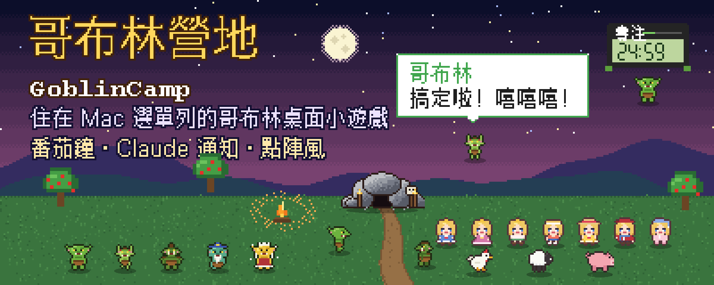
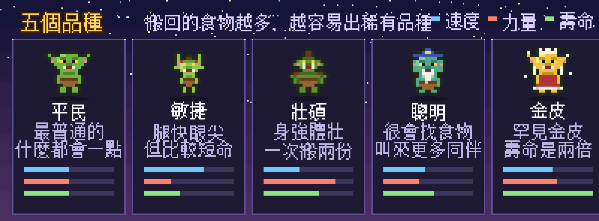
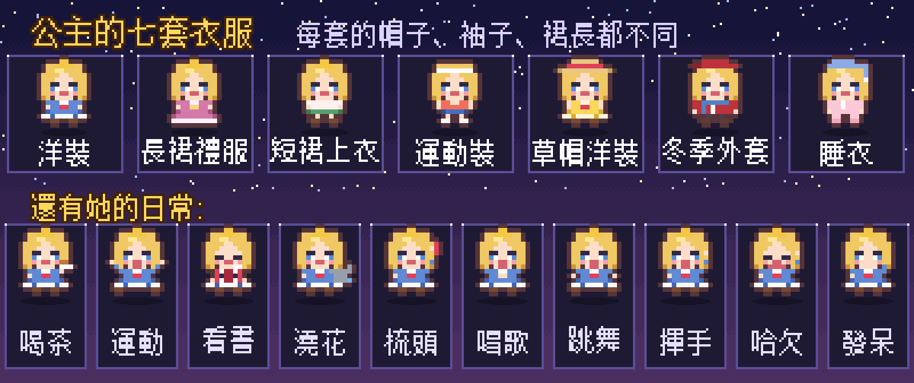
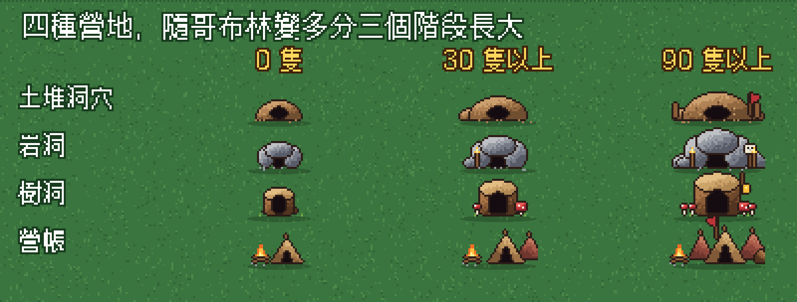
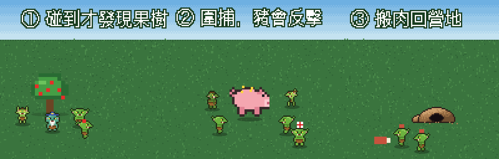
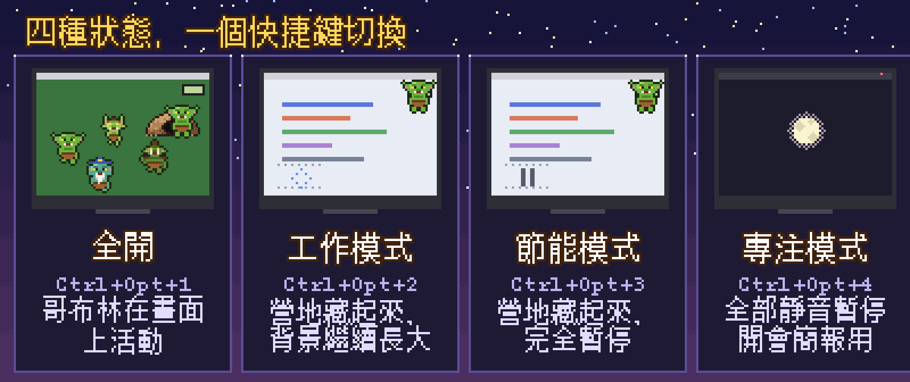
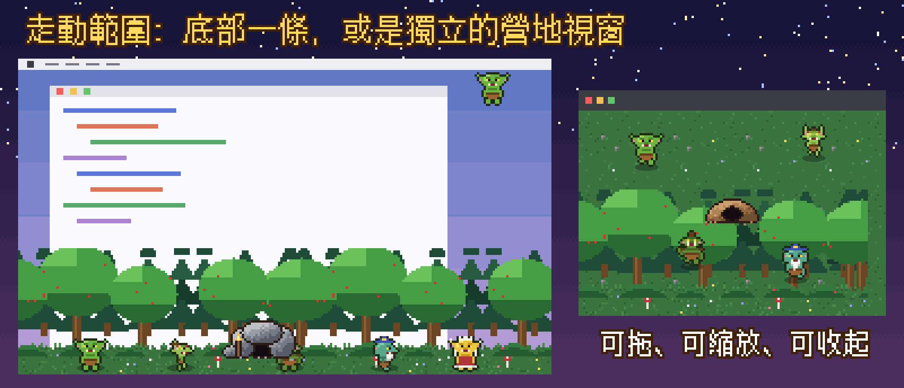
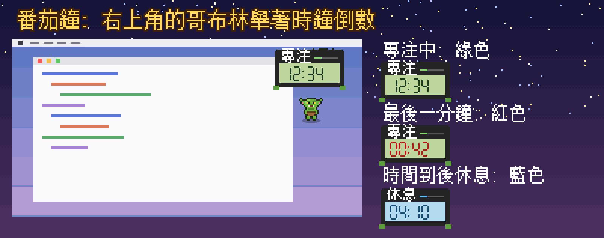
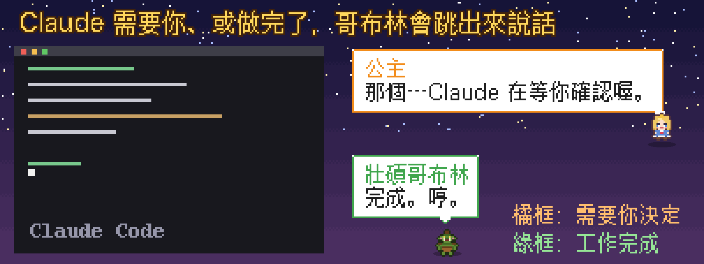
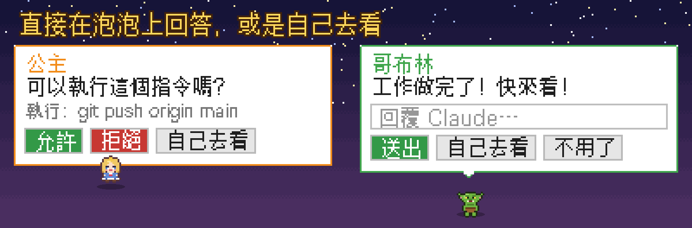

<p align="center">
  
</p>

<h1 align="center">哥布林營地 GoblinCamp</h1>

<p align="center">
  住在 Mac 選單列的點陣風哥布林桌面小遊戲，<br>
  也是一個會跳出來提醒你的番茄鐘與 Claude 通知小工具。
</p>

<p align="center">
  
  
  
  
  
</p>

<p align="center">
  <a href="#這是什麼">簡介</a> ·
  <a href="#快速開始">快速開始</a> ·
  <a href="#特色">特色</a> ·
  <a href="#四種狀態">四種狀態</a> ·
  <a href="#番茄鐘">番茄鐘</a> ·
  <a href="#claude-通知哥布林跳出來說話">Claude 通知</a> ·
  <a href="#開發">開發</a>
</p>

---

## 這是什麼

選一個位置紮營，兩隻哥布林會從最近的螢幕邊，把抓來的人類公主扛進營地；之後哥布林越來越多，在你的整個桌面上晃來晃去。角色蓋在所有視窗上面，但**滑鼠可以直接穿透**，不會擋到你工作。

它不只是好玩，也是拿來**常駐工作**的：

- **番茄鐘**：右上角一隻哥布林舉著電子時鐘幫你倒數，時間到會跳起來提醒你休息。
- **Claude 通知**：Claude Code 需要你決定、或做完事情時，哥布林（有時是公主）跳出來，用各自的聲音與語氣告訴你；**泡泡上可以直接按允許／拒絕、輸入回覆**，或是自己去看。
- **四種狀態**：全開、工作（營地在背景跑）、節能（營地暫停）、專注（完全靜音），可以用快捷鍵一鍵切換；全螢幕影片或簡報時自動專注。

> 前身是「螞蟻農場 AntFarm」，現在專心做哥布林（螞蟻版已移除）。所有圖片都由專案自己的精靈圖與 `tools/make_readme_art.py` 產生。

## 快速開始

### 系統需求

- macOS 13 以上
- Xcode Command Line Tools（`xcode-select --install`），Swift 5.9 以上。**不需要完整 Xcode**。

### 建置與執行

```bash
./build.sh          # 快速建置，產生 GoblinCamp.app（只給這台 Mac 用）
open GoblinCamp.app
```

`build.sh` 用 Swift Package Manager 編譯，再手動組成 `.app` 並做 ad-hoc 簽署。

### 分享給別人

```bash
./build.sh --release   # 同時支援 Apple Silicon 與 Intel，並產生 dist/GoblinCamp-<版本>.zip
```

把 `dist/GoblinCamp-<版本>.zip` 傳給對方即可（**請傳 zip，不要直接傳 `.app`**，否則檔案權限與簽章可能壞掉）。`.app` 是獨立的，裡面已經有全部角色與圖片，不需要專案資料夾、Swift 或任何其他工具。

對方的步驟：

1. 解壓縮，把 `GoblinCamp.app` 拖進「應用程式」資料夾。
2. 第一次打開會被系統擋下（因為沒有 Apple Developer 憑證簽署與公證）：
   - macOS 15 以上：先雙擊打開一次被擋下，再到「系統設定 → 隱私權與安全性」，往下找到「仍要打開」按下去。
   - macOS 13、14：對 App 按右鍵 → 打開。
   - 也可以在終端機執行 `xattr -dr com.apple.quarantine /Applications/GoblinCamp.app`。
3. 用選單的「連接 Claude Code」設定提醒（見下方）。

公司電腦若用 MDM 擋下未簽署的 App，就無法安裝。

### 更新版本

App 會自己更新，不用再傳 zip 給每個人。

發布新版（你這邊）：

```bash
# 1. 改 Resources/Info.plist 的 CFBundleShortVersionString 與 CFBundleVersion
./build.sh --release "這次改了什麼"   # 產生 dist/GoblinCamp-<版本>.zip 與 dist/version.json
# 2. 依照指令最後印出的步驟，把「兩個檔案」一起放到 GitHub Releases
```

`version.json` 是更新用的清單（版本號、下載網址、SHA-256、最低系統版本），必須和 zip 一起上傳到**同一個 release**。App 讀的是 `releases/latest/download/version.json`，GitHub 會自動指向最新的 release，所以網址永遠不用改。

**zip 不要 commit 進 git**（`dist/` 已經在 `.gitignore`）。Releases 的附件跟 commit 歷史是分開的，不會把 repo 撐大。

對方那邊：App 每天看一次有沒有新版，有的話跳出來問，按「更新」就會自己下載、替換、重開。也可以從選單「檢查更新…」手動按。下載的檔案會比對 `version.json` 裡的 SHA-256，對不起來就不安裝。

手動更新（自動更新失敗，或 App 放在沒有寫入權限的地方）：先從選單「結束哥布林營地」，再用新的 `GoblinCamp.app` **取代**舊的（同一個位置），重新打開。

無論自動或手動：

1. **紀錄不會消失**：營地、每一隻哥布林、統計與選單設定都存在 App **外面**（見下方「資料存放位置」），換 App 不會動到它們。Claude Code 的連接也不用重做，前提是新的 App 放在同一個位置（放到別處就再按一次「連接」）。
2. **自動更新不會再被系統擋**：App 自己換上去的版本不帶隔離標記。但如果是手動換 App，每次建置的簽章都不同，系統可能會再擋一次，照上面的步驟放行即可。

之後的版本會維持這些讓舊紀錄能繼續用的約定：套件識別碼（`dev.goblincamp.game`）不變、資料夾名稱（`Application Support/GoblinCamp`）不變、存檔只新增欄位（舊存檔讀得進新版）。


### 玩法

1. 開啟 App，畫面會稍微變暗，出現提示：點一下，選擇營地的位置。還沒想好就按 **Esc** 取消，之後從選單的「選擇營地位置…」再開始。
2. 兩隻哥布林把公主扛進營地、放下後，開始計時，每 10 秒生一隻哥布林（那兩隻是最初的居民）。
3. 不用管它。哥布林會隨機漫步、偶爾停下來，有時會回營地休息一陣子；營地也會隨數量變多而慢慢長大（有上限，不會占滿螢幕）。
4. 想看牠們「工作」的話，從選單「放食物」放一滴水或一坨蜂蜜在畫面上（見下）。

選單列會出現哥布林頭像圖示，所有設定都在裡面。


## 特色

### 哥布林與五個品種

<p align="center"></p>

- **像素風角色，四個方向**：哥布林與公主都是 16×16 的像素畫，會依走路方向轉向、有走路動畫。
- **五個品種**：平民、敏捷、壯碩、聰明、金皮。出生時抽品種：大多是平民，稀有品種的機率會隨**累積搬回的食物**變高，每次出生還有一點隨機突變。每隻還有自己的小差異。
- **數值真的影響動作**：敏捷的走得快、眼尖；壯碩的一次搬兩份；聰明的容易發現食物、叫來的同伴比較多；金皮各方面都好一點。
- **會老死**：每隻有壽命，平民基準是 **1 天**（只計算 App 開著的時間），品種不同壽命不同；快到壽命時走得比較慢，最後會淡出離開，營地有空位再生新的。
- **名冊**：選單「名冊與圖鑑 → 居民名冊」在畫面右側打開直條視窗，列出每一隻的品種、剩餘壽命、數值；點一隻，畫面上會圈出牠。
- **名字**：每隻哥布林出生時有自己的名字（卡通感的名字，例如波米露、米露醬、波波、咕嚕、小米露、噗嘟牙、老蘑菇頭……，共有**一百萬種以上**組合，在世的哥布林之間不會重名）。稱號（像「疾風」、「勇者」）留給之後的稱號系統，不是名字的一部分，可以在名冊裡連按兩下改成自己喜歡的；**第一次玩時要幫公主取名字**（也能之後在選單「公主的名字…」修改）。名字會出現在通知泡泡裡，例如「咕嚕・壯碩哥布林」、「艾莉雅・公主」。

### 公主

<p align="center"></p>

- **公主會換不同款式的衣服**：洋裝、長裙禮服、短裙上衣、運動裝（無袖加短褲）、草帽洋裝、冬季外套（貝雷帽加圍巾）、睡衣（睡帽），不只是換顏色，帽子、袖子、裙長都不同。她偶爾會轉一圈、閃一下光就換好（平均一小時約 18 次）。
- **被抓來的公主有自己的日常**：喝茶（茶几、熱氣）、運動（瑜珈墊）、看書、澆花（花盆）、梳頭髮、唱歌（音符）、睡覺（換睡衣、躺在小床上）、發呆想事情、打哈欠、跳舞……每個活動有專屬姿勢，做之前會先換上合適的衣服（運動前換運動裝、澆花戴草帽…）。並且會對滑鼠有反應（快速掃過會躲進營地、慢慢靠近會好奇、點營地會探頭）。動作陸續換成公主的日常，詳見 [QUEEN_BEHAVIORS.md](QUEEN_BEHAVIORS.md)。

### 營地與覓食

<p align="center"></p>

- **營地會長大**：四種預設營地（土堆洞穴、岩洞、樹洞、營帳），隨哥布林數量分三個階段長大（0／30／90 隻）。也可以換成自己的圖片。
- **可以搬家**：選單的「編輯營地位置」進入編輯模式，拖曳營地就能移動，公主跟著搬，哥布林不受影響；按 Esc 或 Return 結束。
- **會找食物**：放一份水滴或蜂蜜，哥布林**只有剛好走到食物旁邊才會發現**（不會刻意找）。發現的那隻會直接回營地通知同伴，同伴從洞口一隻接一隻出發，沿著幾乎筆直的路線走到食物、圍在邊緣，再各自叼一小份慢慢搬回營地；成功搬回的還會再多叫一兩隻幫忙。食物被搬走會越縮越小，搬完就消失。
- **會回營地休息**：漫步的哥布林平均每 90 秒會回營地，躲在洞裡 10～35 秒再出來（任何時候約 15～20% 在裡面）。

### 自然事件：動物、果樹、打獵

<p align="center"></p>

全部自動發生（選單「營地 → 野生動物與果樹」可調頻率或關閉）：

- **果樹**會在營地附近長出來，哥布林碰到才發現，果實摘光後過一陣子會再長出來。
- **雞、羊、豬**會從螢幕邊走進來閒晃，哥布林走近才發現、回營地報信、成群圍捕；**打獵有風險**：豬會反擊，哥布林可能受傷、甚至犧牲。
- 打倒的動物留下肉，大家一起搬回營地。

### 其他

- **角色可以換**：角色是資料夾裡的精靈圖加一個說明檔，也能放自己畫的角色（見下）。
- **整個桌面都是活動範圍**：支援多螢幕，拔掉外接螢幕時角色和營地會自動搬回剩下的螢幕。
- **可存檔**：營地位置、每一隻的品種／年齡／數值、累積的食物量重開後都還在（也可以關掉存檔）。
- 生成間隔（10 秒／30 秒／1 分鐘／3 分鐘／5 分鐘／自訂）與數量上限可在選單調整；大小與速度固定用預設值。

## 四種狀態

<p align="center"></p>

| | 全開 | 工作模式 | 節能模式 | 專注模式 |
|---|---|---|---|---|
| 快捷鍵 | `⌃⌥1` | `⌃⌥2` | `⌃⌥3` | `⌃⌥4` |
| 營地與哥布林 | 顯示 | 隱藏 | 隱藏 | 隱藏 |
| 營地運行（出生、覓食、老死） | 是 | **是，在背景** | **否，暫停** | **否，暫停** |
| 番茄鐘與 Claude 通知 | 顯示、出聲 | 顯示、出聲 | 顯示、出聲 | 靜音，番茄鐘只計時 |
| 適合 | 想看哥布林時 | 平常工作，營地在背景長大 | 工作但想省效能 | 開會、簡報、影片 |

- 預設啟動在**工作模式**（選單「啟動時的模式」可改）；開始番茄鐘時，若在全開狀態會自動進入工作模式，結束後回來。
- **全螢幕影片或簡報**出現時自動進入專注模式，離開就恢復（選單可關）。全螢幕 App 所在的桌面（在 Mission Control 裡看到的獨立桌面，例如「Arc」）**一定不會**畫出哥布林。
- **桌面**：預設只在「桌面 1」出現哥布林；想工作時切到桌面 2 就完全乾淨（番茄鐘與通知還在）。可在選單「顯示 → 哥布林出現在哪個桌面」設定。
- **走動範圍**：不想讓哥布林蓋滿整個螢幕的話，可以限制在底部一條（像橫向捲軸遊戲的地面，有森林或草地背景）、側邊一條，或乾脆給牠們一個獨立的營地視窗（有自己的地圖，可以拖、縮放、收起來）。背景會跟著電腦的時間換色。

<p align="center"></p>

- **多螢幕**：預設哥布林只住在營地（家）所在的那個螢幕，其他螢幕完全乾淨。可在選單「顯示 → 哥布林出現在哪個螢幕」改成所有螢幕或指定的螢幕。
- 專注模式錯過的通知會在選單列圖示旁顯示「● 數字」；回到全開時，一則小泡泡會告訴你營地多了幾隻、錯過幾則通知。
- 選單列圖示旁的小字顯示目前狀態：工（工作）、省（節能）、靜（專注）。
- 選單可設定「切換模式後持續多久」（30 分鐘、1 小時、2 小時、直到我改變），時間到回到啟動時的模式。

## 番茄鐘

<p align="center"></p>

選單「番茄鐘」：專注 25／休息 5、50／10、15／3 分鐘，或自訂。開始後有一隻哥布林（營地裡隨機一隻）走到主螢幕右上角，舉著電子時鐘倒數（`專注`：綠色 LCD，最後一分鐘變紅；時間到時哥布林跳起來、出聲提醒，時鐘轉成藍色的 `休息` 倒數；休息完哥布林說一句話後走開）。選單裡可看剩餘時間、隨時停止。聲音用「Claude 通知」的音量設定；專注模式中只計時、不出聲，圖示旁會有通知數；工作模式與節能模式下照常顯示。實作在 `Pomodoro.swift`（計時與走位）與 `AntView.drawPomodoro`（七段顯示器）。

- **連續多輪與長休息**：選單有「經典：專注 25／休息 5，連續 4 輪，最後長休息 15 分鐘」，也可以自訂專注、休息、輪數與長休息。時鐘上的字會顯示 `專注2/3`（第幾輪／共幾輪）、`休息`、`長休息`、`暫停`。
- **暫停與跳過**：選單「暫停／繼續」、「跳過這一段」（專注跳到休息、休息跳到下一輪）。暫停時計時凍結，時鐘顯示 `暫停`。
- **休息時的營火晚會**：休息（尤其長休息）時，如果營地藏起來了，會自動把營地顯示出來，並在營地旁升起營火，哥布林會一隻隻走過來圍著火堆；休息結束就熄火、回到原本的模式。選單「休息時顯示營地（營火晚會）」可以關掉。

## Claude 通知（哥布林跳出來說話）

<p align="center"></p>

任何 Claude Code 需要你時，右上角會有哥布林（有時是公主）走出來，用氣泡和聲音告訴你；點一下泡泡會把跑 Claude 的終端機／編輯器帶到最前面。

- **誰來說話**：25% 是公主（輕柔的聲音、鈴聲），其餘是營地裡某一隻哥布林的品種：平民（尖聲加嘻嘻笑）、敏捷（快速尖叫）、壯碩（低沉悶哼）、聰明（嗯哼、慢條斯理）、金皮（高傲、閃亮音效）。每種有自己的聲音、語氣、台詞（`Notifier.swift` 的 `Speakers`）。氣泡標題是說話者的名稱（哥布林、壯碩哥布林、公主…），下面小字是專案資料夾名。
- **選單「Claude 通知」**：整體開關、要不要在「需要我決定」「工作完成」時出現、泡泡可直接回覆（開關與等待時間）、聲音（關／小／中／大）、試試看（隨機、公主、壯碩哥布林、詢問允許、可以回覆）。
- **專注模式中**（含全螢幕自動專注）：不跳出、不出聲，選單列圖示旁出現「● 數字」，選單的「回到全開」會寫「期間有 N 則通知」。工作模式與節能模式下通知照常出現。
- 6 秒內同類通知只會出一次，最多排 3 個。

### 直接在泡泡上回覆 Claude

<p align="center"></p>

泡泡不只是提醒，也可以當場回答，或是「自己去看」：

- **Claude 要求授權時**（`PermissionRequest` hook）：泡泡寫出 Claude 想做什麼（例如「執行：git push origin main」），有**允許**、**允許並記住**、**拒絕**、**自己去看**四個按鈕。「允許並記住」等於 Claude Code 自己的「不要再問」：只在**這一次對話**裡，同類的操作（例如 `Bash(git push:*)`）之後都自動允許，不會寫進任何設定檔，關掉這次對話就失效；沒有可記住的項目時不會出現這個按鈕。按允許或拒絕，答案直接送回 Claude Code；按「自己去看」或超過等待時間（選單可設 15／30／60 秒），Claude Code 就照平常在終端機顯示自己的授權畫面。
- **Claude 做完一輪時**（`Stop` hook）：泡泡有輸入框，打字按 Return 或「送出」，你輸入的話會變成 Claude 的下一個指示（它會接著繼續做）；「自己去看」會把終端機帶到最前面；「不用了」或沒回應就照平常結束。
- 遊戲沒開、在專注模式（含全螢幕自動專注）、或選單關掉「泡泡可直接回覆」時，hook 不會等你，也不會擋住 Claude Code；關掉回覆功能時仍會跳出一般的提醒泡泡。
- 泡泡上會顯示指令的前幾十個字，方便你判斷；這些文字只在你自己的螢幕上顯示，不會傳到任何地方。

### 連接 Claude Code（在選單裡按一下，不需要終端機）

選單 **「連接 Claude Code」→「連接（泡泡可回覆，建議）」**，會跳出說明視窗，按「連接」就完成了。它會：

1. 在 `~/.claude/hooks/` 放一個小腳本 `goblincamp-hook.sh`（把 Claude Code 的事件交給遊戲）；
2. 先把 `~/.claude/settings.json` 備份成 `settings.json.bak-goblincamp`，再加入三個 hook：`PermissionRequest`（要求授權）、`Stop`（做完一輪）、`Notification`（只在 Claude 閒置等你或問你問題時）。

你原本的其他設定與 hook 都不會被動到（設定檔的欄位會依字母排序重新寫入）。設定檔如果不是正確的 JSON，會直接停下來，不會改任何東西。

- 完成後在 Claude Code 輸入 `/hooks` 確認，或重新開啟 Claude Code。
- 選單另有「連接（只有一般提醒）」（不能回答）與「移除連接」；選單會顯示目前狀態（尚未連接／已連接／需要更新）。
- **把哥布林營地搬到別的位置後**，請再按一次「連接」（腳本記的是它目前的位置；找不到程式時 hook 會安靜地什麼都不做，不會擋住 Claude Code）。
- **給同事用**：照上方「分享給別人」把 App 放進「應用程式」資料夾並放行，再按選單的「連接 Claude Code」即可。從下載資料夾直接開的話，系統會把程式放在暫時的位置，選單會請你先移到「應用程式」。

**手動設定**（想自己改設定檔時）：選單做的事等於在 `~/.claude/settings.json` 加上下面這一塊，`/path/to/goblincamp-hook.sh` 是選單放的那個腳本（`~/.claude/hooks/goblincamp-hook.sh`），或直接寫 `"/Applications/GoblinCamp.app/Contents/MacOS/GoblinCamp" --hook …`：

```json
{
  "hooks": {
    "PermissionRequest": [
      { "hooks": [{ "type": "command", "command": "/path/to/goblincamp-hook.sh ask permission", "timeout": 70 }] }
    ],
    "Stop": [
      { "hooks": [{ "type": "command", "command": "/path/to/goblincamp-hook.sh ask reply", "timeout": 70 }] }
    ],
    "Notification": [
      { "matcher": "idle_prompt|elicitation_dialog",
        "hooks": [{ "type": "command", "command": "/path/to/goblincamp-hook.sh notify permission" }] }
    ]
  }
}
```

- 只要一般提醒、不要回答：`Notification` → `notify permission`、`Stop` → `notify done`。
- `timeout` 是這個 hook 最多等多久（秒），要比選單的「等你回覆多久」長。
- 測試：先開著哥布林營地，在終端機執行
  `echo '{"cwd":"/path/to/project","tool_name":"Bash","tool_input":{"command":"ls"}}' | /Applications/GoblinCamp.app/Contents/MacOS/GoblinCamp --hook ask permission`，右上角會有哥布林問你能不能執行；按「允許」，終端機會印出一行 JSON。
- 專案裡的 `tools/goblin-notify.sh`、`tools/goblin-ask.sh` 只是舊設定用的轉接腳本，效果一樣。

**通訊方式**：hook 是遊戲執行檔的小幫手模式（`GoblinCamp --hook …`，不需要 Python 或其他工具），用 `goblincamp://notify` / `goblincamp://ask` 交給執行中的遊戲，問答則在 `~/Library/Application Support/GoblinCamp/replies/` 用一次性編號的檔案傳答案（收到確認 4 秒內沒有就放棄，不會讓 Claude Code 卡住）。遊戲沒開時它什麼都不做。每次 `./build.sh` 會重新向系統登記 `goblincamp://`。

## 選單一覽

選單列的哥布林圖示點開來，常用的在最上面，其他分成幾組：

```
哥布林數：N                       （狀態）
暫停
模式：全開／工作模式／節能模式／專注模式    （⌃⌥1～4）
番茄鐘 ▸
Claude Code ▸   連接 · 通知 · 提醒顯示的螢幕
營地 ▸          放食物 · 工坊 · 編輯／重新選擇營地位置 · 公主的名字 · 營地外觀
                生成速度 · 哥布林數量上限 · 野生動物與果樹 · 魔獸來襲頻率
名冊與圖鑑 ▸    居民名冊 · 魔獸與素材圖鑑 · 每日統計
顯示 ▸          走動範圍與地圖（▸ 營地視窗：收起／永遠在最上面／回到右下角／地貌／場地隨時間變化／天氣）
                哥布林出現在哪個螢幕 · 哪個桌面 · 全螢幕時自動專注 · 效能保護
偏好設定 ▸      角色 · 啟動時的模式 · 切換模式後持續 · 全域快捷鍵 · 開機時自動啟動 · 儲存進度
                自動檢查更新
說明手冊… · 檢查更新… · 複製診斷資訊 · 關於哥布林營地 · 結束
```

## 功能與設定說明

下面依功能說明各項設定與玩法（項目所在的選單見上面的一覽）。

| 項目 | 說明 |
|---|---|
| 暫停 / 繼續 | 暫停時所有角色（含公主）都停住 |
| 選擇營地位置… / 重新選擇營地位置 | 進入選位置畫面（點一下決定，**Esc 取消**）。已有營地時，要真的點下新位置才會清空哥布林；按 Esc 就維持原樣 |
| 放食物 | 水滴 / 蜂蜜：選一種後點畫面放下（**Esc 取消**）。最多同時 6 份，最舊的會被取代；「清除所有食物」可全部收走。需要先有營地 |
| 編輯營地位置 | 畫面微暗、營地周圍出現虛線圈，拖曳它就能移動；Esc、Return 或再按一次選單結束。哥布林會繼續走動 |
| 角色 | 只有一個角色時不顯示；放了自訂角色（見下）就會出現 |
| 居民名冊 | 在畫面右側打開／關閉名冊視窗：每一隻的名字、品種、現在在做什麼（走動、釣魚、睡覺、小孩…）、穿了幾件裝備、剩餘壽命；點一隻，下面有詳細資料（數值、每件裝備的耐久、活動），畫面上會圈出牠 |
| 公主的名字… | 修改公主的名字（第一次玩、或舊存檔第一次打開新版時會先問一次） |
| 全開／工作模式／節能模式／專注模式 | 選單最上面四個項目（打勾表示目前），也可用 `⌃⌥1`～`⌃⌥4` 全域快捷鍵。四種狀態的差別見上方「四種狀態」 |
| 切換模式後持續 | 直到我改變（預設）／30 分鐘／1 小時／2 小時；時間到回到「啟動時的模式」 |
| 啟動時的模式 | 全開／工作模式（預設）／節能模式／專注模式；第一次玩（還沒有營地）時固定從全開開始，好讓你選營地位置 |
| 全域快捷鍵 | `⌃⌥1`～`⌃⌥4` 切換四種狀態，可關閉 |
| 哥布林出現在哪個螢幕 | 有多個螢幕時：**家（營地）所在的螢幕（預設）**、所有螢幕，或勾選指定的螢幕。沒選到的螢幕完全沒有哥布林，可以專心工作（動物、食物、營地也只在選到的螢幕上）。家會跟著營地走：拖曳營地到另一個螢幕，家就換過去 |
| 天氣（下雨） | 營地視窗與底部／側邊一條會偶爾下雨（下面畫一層藍色的雨絲，整個螢幕**不會**下，免得擋住工作）。下雨時哥布林多半躲在營地裡休息，同時出來走動的數量降到約三分之一。開程式後前 20～60 分鐘先是晴天。「顯示 → 走動範圍與地圖 → 營地視窗」裡可以關掉「天氣：偶爾下雨」，或按「現在下一場雨（試試看）」 |
| 地貌（營地視窗） | 營地視窗是一個**由種子生成的場景**，有四種主題：**草地、森林空地、雪地、沼澤**。每個場景不一樣：0～4 個大小不同的池塘（沼澤有好幾個小的爛泥池；雪地的池塘是結冰的）、有時一條蜿蜒的小溪與木橋（雪地的溪是結冰的，可以直接走過去）、樹叢、石頭堆、倒木、蕨類與草叢、彎彎的小路、花田、蘑菇（一叢一叢，大小顏色不同，多長在樹與石頭旁）、雪堆、爛泥，有時還有一圈立石。**哥布林住得比較原始**：巢穴四周是踩實的泥地，有獸皮帳篷、圖騰柱、曬肉架、柴堆、骨頭、插著頭骨的木樁、長矛，還有一圈石頭圍成的營火坑（番茄鐘休息的營火晚會就點在那裡）。哥布林會繞過水、樹、石頭與帳篷，只能從橋過溪。場景存檔，營地保持自己的樣子；選單「顯示 → 走動範圍與地圖 → 營地視窗 → 地貌」可以換主題或「重新生成地貌」。**場地會一直變**：四季（一季 3 天，樹葉變色飄落、積雪、池塘結冰、開花）、下雨後的水窪、隨機冒出並慢慢長大的樹苗、被哥布林踩出來的小路，還有霧、螢火蟲與落葉；都有機率性，關掉程式再打開會補上這段時間發生的事。詳見 [TERRAIN.md](TERRAIN.md) |
| 魔獸來襲 | 全開模式下，營地偶爾會有魔獸從螢幕邊走進來（第一版：**史萊姆**、**巨鼠**）。它們會追打在外面的哥布林、被打時會停下來反擊，攻擊有蓄力與出擊的動作（史萊姆跳起壓下、巨鼠撲咬）；哥布林會出來圍打、受傷的走回營地休息，**公主會躲進洞裡**，之後出來**治療**傷兵（頭上冒綠色十字）。魔獸倒下會掉素材（每種至少三樣、各有機率，稀有的會閃爍），哥布林搬回營地放進倉庫。「營地 → 魔獸來襲頻率」調頻率或關閉，「名冊與圖鑑 → 魔獸與素材圖鑑」看素材。除了史萊姆與巨鼠，還有**沼澤青蛙**（有水的地方，舌頭伸得很長）與**蝙蝠**（只在夜晚成群飛來），各有自己的素材與地貌限制。詳見 [MONSTERS.md](MONSTERS.md) |
| 砍樹與採石 | 白天閒著的哥布林會去砍樹（拿木片）、採石頭（拿廢鐵，偶爾有碎晶、蜂巢）；倒下的樹留下樹樁、石頭一塊塊縮小；全部是機率，而且不會砍光（樹只剩 6 棵就只砍樹枝，被挖光的石頭過幾天會有新的浮出來）。詳見 [TERRAIN.md](TERRAIN.md) |
| 煮飯、耕田、照顧小哥布林 | 營地長大後，哥布林會在**石頭火坑煮燉菜**（用釣到的魚與種出來的菜，用餐時間最常煮，有時香噴噴、有時燒焦、偶爾打翻鍋子）、照顧**田地**（翻土、播種、澆水、收成，看季節與天氣，偶爾長出超大南瓜）；**新生的哥布林是小的**，先在巢穴附近玩，長大的會照顧牠、牠偶爾感冒。**遊戲的進度（魔獸何時出現、小孩長大、作物生長）跟著「生成速度」走**，季節與天氣不跟著走。魔獸也是要遊戲進行一段時間、營地有一定規模才會來。詳見 [LIFE.md](LIFE.md) |
| 公主的感情線 | 遊戲進行一天以後，隨機的某個時候金皮哥布林會開始追求公主（可能失敗、可能好幾天都沒有）。成功會**牽手散步、擁抱、有護衛跟著的遠行約會、晚上同床聊天**，也會**吵架、冷戰、分手**；有機會**結婚**、**懷孕**（孕婦裝，肚子慢慢變大），生下**混血寶寶**（偏哥布林／各半／偏人三種新品種，男女各半）。所有哥布林有公母，母的有粉紅蝴蝶結。詳見 [ROMANCE.md](ROMANCE.md) |
| 日常活動 | 哥布林閒著會**睡覺**（側躺、偶爾翻身，沒有 zzz）、**釣魚**（池塘邊，釣到魚算食物）、**玩耍**、**看書**、**打鬧**（不受傷）；**聰明的不打鬧**、愛看書釣魚，**金皮**戴小金冠巡視、有普通哥布林在旁伺候。太卡時**效能保護**自動減少同時出現的哥布林。詳見 [LIFE.md](LIFE.md) |
| 工坊與裝備 | 「營地 → 工坊」：用素材做**武器**（骨刀、短劍、長劍、雙刀、雙手劍、長槍、弓箭、法杖…）、**盾牌**、**帽子、胸甲、褲子、鞋子、手甲**（布、皮、鐵）。做好的會自動交給最需要的哥布林，畫在牠身上，讓牠出手更重、更耐打、更會擋、走更快；哥布林出手時有攻擊動作（揮砍、刺、射箭、光球）。所有魔獸都可能掉碎布、木片、廢鐵。詳見 [EQUIPMENT.md](EQUIPMENT.md) |
| 走動範圍與地圖 | **整個螢幕**（預設）、**底部一條**（貼著 Dock 上緣）、**右邊一條**、**左邊一條**，或**獨立的營地視窗**。一條有多厚可選（薄、中〔預設，約 42 點高〕、厚、很厚），背景可選森林、草地或沒有；底部一條是橫向的樹林，左右兩邊的一條是直立的（樹一棵一棵往上疊，草地靠螢幕邊）；營地視窗有自己的草地，四周一圈森林，視窗拉多大都有，可以拖、縮放、縮到 Dock 或按關閉鈕收起來（不會自己彈回來）、回到右下角、設成永遠在最上面。背景會跟著電腦的時間變色：傍晚偏橘、夜晚偏藍 |
| （走動方式） | 範圍小的時候，同時出來走動的哥布林會減少（大約每 2200 平方點一隻，一條大約 20 隻、整個螢幕 600 隻以上），其他的在營地裡休息、有空位再出來，所以就算有 500 隻也不會全擠在一條裡。哥布林會依走動範圍調整：整個螢幕全速亂走；底部或側邊一條時放慢一點、沿著那一條來回巡邏；營地視窗這種小範圍也稍微放慢。視窗縮小或放大時，同時出來走動的數量會跟著調整（縮小後約 20 秒內降到新的上限，放大後約半分鐘內增加）。碰到邊界像球一樣彈開，不會在牆邊原地打轉；轉向時會維持一下原本的朝向，不會在正面與側面之間閃來閃去 |
| 哥布林出現在哪個桌面 | 「所有桌面」或勾選「桌面 1」「桌面 2」……；**預設只有桌面 1**。營地的視窗只「存在」於勾選的桌面（用系統的桌面資訊直接指定），所以切到別的桌面時**連一格都不會出現**，也不會有「先出現再消失」；番茄鐘與通知另外放在全部桌面。全螢幕 App（影片、簡報）所在的桌面永遠不會有哥布林 |
| （視窗層級） | 所有哥布林、番茄鐘與泡泡的視窗都放在 Dock 的下面一層：Dock、選單列、Spotlight、Mission Control、通知橫幅、控制中心永遠在最上面，不會被哥布林蓋住或互相打架；一般 App 的視窗則在哥布林的下面 |
| 提醒顯示的螢幕 | 番茄鐘與通知出現在哪個螢幕的右上角：游標所在（預設）、主螢幕，或指定第二螢幕 |
| 全螢幕時自動專注 | 開（預設）／關 |
| 開機時自動啟動 | 勾選項，預設關 |
| 每日統計… | 今天與近 7 天：番茄鐘完成數、專注分鐘、Claude 通知數 |
| 生成速度 | 每 10 秒（預設）／ 30 秒 ／ 1 分鐘 ／ 3 分鐘 ／ 5 分鐘一隻，或「自訂…」（輸入 45、30s、5m、1.5h、90秒 都可以；1 秒到 24 小時） |
| 數量上限 | 50 / 100 / 150（預設）/ 300 / 500 / 1000，各角色分開記 |
| 營地外觀 | 土堆洞穴（預設）／ 岩洞 ／ 樹洞 ／ 營帳 ／ 自己的圖片…（含圖片大小）；每種營地隨哥布林數量分三個階段長大 |
| 儲存進度 | 開（預設）/ 關 |
| 說明手冊… | 在程式裡打開說明手冊（開始玩、四種狀態、番茄鐘、連接 Claude Code、常見問題） |
| 關於哥布林營地 | 顯示版本（目前 0.7.0）與資料存放位置 |

食物**不會存檔**：重開 App 後畫面上的食物就沒了（營地與數量會還原）。

自己的營地圖片建議用透明背景的 PNG；一般 JPG 會帶著方形底色。

## 資料存放位置

App 的資料都在你的使用者資料夾裡，**不在專案資料夾內，也不會進 git**：

| 內容 | 位置 |
|---|---|
| 營地位置、每一隻的品種／年齡／數值 | `~/Library/Application Support/GoblinCamp/state.json` |
| 自訂營地圖片（縮小後的副本） | `~/Library/Application Support/GoblinCamp/nest.png` |
| 自訂角色 | `~/Library/Application Support/GoblinCamp/Characters/<角色名>/`（格式見下） |
| 選單設定 | UserDefaults，網域 `dev.goblincamp.game` |

完全重置：

```bash
rm -rf ~/Library/Application\ Support/GoblinCamp
defaults delete dev.goblincamp.game
```

App 不會讀取鍵盤、也不會錄製螢幕；只用到滑鼠的位置和點擊位置（用來讓公主對游標有反應）。

## 開發

### 專案結構

```
├── Package.swift
├── build.sh                    # 編譯並組出 GoblinCamp.app（含角色、營地與 App 圖示）
├── docs/images/                # README 的封面與說明圖（點陣風）
├── Resources/
│   ├── Info.plist              # LSUIElement（沒有 Dock 圖示）、bundle id、圖示
│   ├── AppIcon.icns            # App 圖示（由 tools/make_icons.py 產生）
│   ├── Characters/goblin/      # 內建角色：五個品種的哥布林、公主、頭像（由 tools/make_goblin.py 產生）
│   ├── Camps/                  # 四種預設營地，各三個成長階段（由 tools/make_camps.py 產生）
│   ├── Scenery/                # 森林、草地、營地視窗草地（由 tools/make_scenery.py 產生）
│   ├── Terrain/                # 營地視窗四種主題的地面、樹、石頭、營地小物、會長大的樹（由 tools/make_terrain.py 產生）
│   └── Animals/                # 雞、羊、豬與魔獸（史萊姆、巨鼠）（由 tools/make_animals.py、make_monsters.py 產生）
├── tools/
│   ├── make_goblin.py          # 用程式畫哥布林各品種、公主與頭像，輸出精靈圖與 manifest.json
│   ├── make_camps.py           # 畫預設營地
│   ├── make_scenery.py         # 畫森林、草地與營地視窗的草地（Resources/Scenery）
│   ├── make_animals.py         # 畫雞、羊、豬
│   ├── make_monsters.py        # 畫魔獸（史萊姆、巨鼠）的走路與攻擊姿勢，寫下血量與掉落
│   ├── make_terrain.py         # 畫營地視窗的地形與營地小物（Resources/Terrain）
│   ├── pixelart.py             # README 圖片用的點陣繪圖小工具
│   ├── make_readme_art.py      # 產生 docs/images 裡的封面與說明圖
│   ├── goblin-notify.sh        # 舊設定用的轉接腳本（呼叫遊戲的 --hook 模式）
│   ├── goblin-ask.sh           # 同上，可回答的版本
│   └── make_icons.py           # 產生 AppIcon.icns
└── Sources/GoblinCamp/
    ├── main.swift              # 進入點（先跑舊資料搬家）
    ├── AppDelegate.swift       # 選單列、覆蓋視窗、主迴圈（30fps，數量多時 20fps）
    ├── OverlayWindow.swift     # 每個螢幕一個透明、滑鼠可穿透的視窗
    ├── AntView.swift           # 全部繪製：角色、營地、氣泡、食物、選取圈
    ├── RosterPanel.swift       # 右側名冊視窗
    ├── Character.swift         # 角色：讀精靈圖與 manifest、方向與影格、品種清單
    ├── Camp.swift              # 營地外觀：讀圖與成長階段
    ├── Breed.swift             # 品種、個體特質、出生時抽品種
    ├── Colony.swift            # 遊戲狀態：營地、居民、食物、出生與老死、螢幕變化
    ├── Ant.swift               # 單一居民：漫步、回巢休息、覓食、搬運、老死（名稱沿用 Ant，是「居民」的通稱）
    ├── Queen.swift             # 公主的狀態機
    ├── Food.swift              # 食物種類與資料
    ├── Animal.swift            # 動物與魔獸：資料、走路、追擊、蓄力與出擊、反擊
    ├── Materials.swift         # 魔獸掉落的素材、稀有度、擲骰子（含所有魔獸都會掉的雜物）
    ├── Equipment.swift         # 裝備：七個部位、24 款配方、耐久度
    ├── WorkshopWindow.swift    # 工坊視窗：用素材做武器與裝備
    ├── Pond.swift              # 池塘：不規則輪廓、小島、石頭、蘆葦；清澈、結冰、混濁三種水
    ├── Terrain.swift           # 營地視窗的場景：四種主題、由種子生成、烘成一張圖、依季節上色
    ├── TerrainLife.swift       # 場地持續變化：季節、雨後水窪、樹苗長大、被踩出的小路、補算離線時間
    ├── Perf.swift              # 效能保護：太卡時減少同時出現的哥布林
    ├── Notifier.swift          # Claude 通知：說話者（各品種與公主）、泡泡、音效與語音
    ├── Scenery.swift           # 森林、草地、營地視窗草地（載入與依時間變色）
    ├── MapWindow.swift         # 獨立的營地視窗
    ├── Diagnostics.swift       # 最近的顯示／隱藏變化，選單可複製診斷資訊
    ├── ScreenChoice.swift      # 有多個螢幕時，哥布林可以在哪些螢幕（家、所有、指定）
    ├── Spaces.swift            # 讀出每個螢幕現在是哪個桌面（全螢幕 App 也算），決定哥布林要不要出現
    ├── Names.swift             # 哥布林的名字與公主的名字點子
    ├── ManualWindow.swift      # 說明手冊（選單「說明手冊…」）
    ├── AskPanel.swift          # 可回答的泡泡（按鈕與輸入框）
    ├── HookCLI.swift           # Claude Code hook 的小幫手模式（GoblinCamp --hook …）
    ├── HookInstaller.swift     # 選單一鍵連接 Claude Code：寫腳本、改 settings.json、移除
    ├── Pomodoro.swift          # 番茄鐘：計時、哥布林舉時鐘
    ├── Stats.swift             # 每日統計（番茄鐘、通知）
    ├── HotKeys.swift           # 全域快捷鍵 ⌃⌥1～4
    ├── Settings.swift          # 選單設定（UserDefaults）與時間格式
    ├── Persistence.swift       # state.json 存檔
    ├── NestImageStore.swift    # 自己的營地圖片
    └── SeededRandom.swift      # 可重現的亂數（個體特質）
```

座標一律使用全域螢幕座標（原點在主螢幕左下角）；每個視窗繪製時再減掉自己的原點。

### 自訂角色

一個角色就是一個資料夾，放在 `~/Library/Application Support/GoblinCamp/Characters/<名稱>/`，內容仿照 `Resources/Characters/goblin/`：

- `manifest.json`：`id`、`name`（選單顯示）、`noun`（例如「哥布林」）、`emoji`、`nestName`（例如「營地」）、`frame`（每格邊長，內建是 16）、`icon`（選單列小圖，可省略）、`defaultMaxCount`，以及 `worker`（必要）與 `queen`（可省略，省略時用 `worker`）。
- `breeds`（可省略）：品種清單，每個有 `id`、`name`、`weight`（出生比例）、`boost`（累積食物對機率的加成）、`sheet`、`blurb` 與 `stats`（`speed`、`sense`、`rest`、`lifespan` 為倍率，`carry` 為一次搬幾份，`recruit` 為通知時多叫幾隻）。沒寫時只有一個平民，用 `worker` 的圖。
- 每個角色（`worker`／`queen`）有 `sheet`（精靈圖檔名）、`pixelScale`（每個像素幾點，預設大小下）和 `walk`：`down`、`up`、`side` 各一串影格編號。`side` 畫面向右，向左由程式鏡像。
- 精靈圖是 PNG，每格 `frame`×`frame`，由左到右、由上到下編號。可以用 Aseprite、Piskel 這類點陣編輯器畫。

座標一律使用全域螢幕座標（原點在主螢幕左下角）；每個視窗繪製時再減掉自己的原點。

### 測試用環境變數

需要直接執行執行檔才會帶入（`open` 不一定會傳環境變數）：

```bash
CAMP_SPAWN_INTERVAL=1 CAMP_AUTO_NEST=1 CAMP_NO_SAVE=1 GoblinCamp.app/Contents/MacOS/GoblinCamp
```

| 變數 | 作用 |
|---|---|
| `CAMP_SPAWN_INTERVAL` | 覆蓋生成間隔（秒） |
| `CAMP_AUTO_NEST` | 啟動時自動在主螢幕中央築巢，跳過選位置 |
| `CAMP_NO_SAVE` | 不讀也不寫存檔（測試時避免動到真實進度） |
| `CAMP_NO_NEST_IMAGE` | 忽略自訂營地圖片，測試預設外觀 |
| `CAMP_LIFESPAN=秒` | 覆蓋平民的壽命（預設 86400 秒 = 1 天） |
| `CAMP_TIME_SCALE=倍數` | 讓年齡增加得更快（測試老死） |
| `CAMP_TEST_ROSTER=秒` | 該時間點打開名冊並選中一隻（配合 `CAMP_SNAPSHOT` 會把名冊視窗也截圖存成 `-roster.png`） |
| `CAMP_DEBUG` | 每次生成角色或還原存檔時印 log |
| `CAMP_QUEEN_FORCE=名稱` | 強制公主進入某個動作（sleeping、yawning、thinking、dancing、digging、carrying、peeking） |
| `CAMP_SNAPSHOT=/路徑前綴` `CAMP_SNAPSHOT_AFTER=秒` | App 把自己的視窗（營地附近）截圖存成 PNG，不需要螢幕錄製權限；加 `CAMP_SNAPSHOT_FULL=1` 改截整個螢幕（縮小一半） |
| `CAMP_TEST_ESC=秒` | 用合成事件按一次 Esc（測試取消選位置） |
| `CAMP_TEST_FOOD=種類,dx,dy` | 用合成事件走完「選單放食物 → 點擊放下」：在營地旁 (dx, dy) 放 `water` 或 `honey`，並每 5 秒印一次覓食狀態；加 `CAMP_TEST_FOOD_CANCEL=1` 會另外測試放食物時按 Esc |
| `CAMP_TEST_POMODORO=專注分,休息分[,輪數,長休息分]` | 3 秒後開始番茄鐘（可填小數分鐘，例如 `0.25,0.15`；後面可加輪數與長休息） |
| `CAMP_TEST_PAUSE` | 搭配 `CAMP_TEST_POMODORO`：6 秒暫停、10 秒繼續、12 秒跳過這一段，印出剩餘時間確認 |
| `CAMP_WEATHER=rain／clear` `CAMP_WEATHER_SCALE=倍數` | 一開始就下雨／晴天；倍數可加快天氣變化 |
| `CAMP_TEST_WILD=id,dx,dy` | 4 秒時在營地旁放一隻動物或魔獸（`slime`、`giant_rat`、`pig`…），並每 3 秒印一次戰況（血量、是否在反擊、受傷人數、素材、公主的狀態），45 秒時印倉庫 |
| `CAMP_WILD_SCALE=倍數` | 讓自然事件與魔獸來得更頻繁（測試） |
| `CAMP_TEST_WORKSHOP=路徑.png` `CAMP_TEST_GEARSHEET=路徑.png` | 工坊與裝備的測試（見 [EQUIPMENT.md](EQUIPMENT.md)） |
| `CAMP_PACE` `CAMP_COOK_SCALE` `CAMP_FARM_SCALE` `CAMP_MIND_SCALE` `CAMP_CHILD_MINUTES` `CAMP_TEST_WATCH` `CAMP_TEST_LARDER` | 遊戲節奏、煮飯、種田、照顧小孩的測試（見 [LIFE.md](LIFE.md)） |
| `CAMP_ROMANCE` `CAMP_ROMANCE_STAGE` `CAMP_ROMANCE_SCALE` `CAMP_ROMANCE_CHEM` `CAMP_ROMANCE_FORCE` | 公主感情線的測試（見 [ROMANCE.md](ROMANCE.md)） |
| `CAMP_BREEDS` `CAMP_TEST_LIFE` `CAMP_TEST_ACTSHOT` `CAMP_PERF_BUDGET` `CAMP_TEST_PERFGUARD` | 日常活動與效能保護的測試（見 [LIFE.md](LIFE.md)） |
| `CAMP_TEST_STUCK` | 每 30 秒檢查一次有沒有在外面卻十幾秒都沒動的哥布林，印出模式與位置 |
| `CAMP_TERRAIN=草地／森林空地…的英文名` `CAMP_TERRAIN_SEED=數字` | 固定營地視窗的主題（`meadow`、`forest`、`snow`、`swamp`）與種子（測試） |
| `CAMP_TERRAIN_SPEED` `CAMP_SEASON_DAYS` `CAMP_TEST_SEASONS` | 場地持續變化的測試：讓時間跑得快、改變季節長度、畫一年的總表（見 [TERRAIN.md](TERRAIN.md)） |
| `CAMP_TEST_TERRAINSHEET=路徑.png` | 不開視窗，把四種主題各四個種子的場景畫成一張圖，並印出每個場景的內容 |
| `CAMP_TEST_MAPSIZE=寬x高` | 1 秒時把營地視窗調成這個大小（例如 `900x600`） |
| `CAMP_CLAUDE_DIR=資料夾` `CAMP_TEST_HOOKINSTALL=interactive／simple／uninstall／status` | 把「連接 Claude Code」的動作對到另一個資料夾測試（不動真正的 `~/.claude`），做完就結束 |
| `CAMP_DATA_DIR=資料夾` | 把存檔（`state.json`）改存到別處，測試時不動真正的存檔 |
| `CAMP_HOUR=0..23` | 假裝現在幾點（測試背景的日夜變色） |
| `CAMP_TEST_SPIN` | 20 秒內記錄每隻哥布林朝向變了幾次（旋轉、閃爍會讓數字變大），並印出範圍、公主、人數、動物的報告 |
| `CAMP_TEST_QUEEN` | 每 4 秒印出公主在哪、在做什麼 |
| `CAMP_UPDATE_FEED=網址` | 把「檢查更新」指到別的 `version.json`（可以用 `file://` 指到本機檔案）測試 |
| `CAMP_NO_UPDATE` | 完全關掉更新（開發中的 build 不會把自己換掉），選單也不顯示「檢查更新」 |
| `CAMP_TEST_UPDATE=秒` | 該時間點直接檢查並安裝，不跳任何對話框。**只能對複製出來的 App 用**，它真的會覆蓋掉那個 `.app` |
| `CAMP_TEST_MAPRESIZE` | 把營地視窗縮小再放大，印出同時出來走動的哥布林數量的變化 |
| `CAMP_TEST_MAPMIN` | 8 秒時把營地視窗縮到 Dock，確認它不會自己彈回來 |
| `CAMP_TEST_MAPSHOT=路徑` | 25 秒時把營地視窗畫成 PNG（搭配 `-rangeMode window`） |
| `CAMP_TEST_SCREENCHOICE` | 用兩個假螢幕印出「哥布林可以在哪些螢幕」的規則測試結果 |
| `CAMP_FAKE_SPACE=1／2／fs` | 假裝目前在桌面 1、桌面 2 或全螢幕 App 的桌面（測試用） |
| `CAMP_TEST_NAMES=set／show` | 測試名字：`set` 在 20 秒時改名並存檔，`show` 印出載入的名字 |
| `CAMP_TEST_MANUAL=路徑` | 打開說明手冊並把它畫成 PNG |
| `CAMP_TEST_ASKANSWER=allow／deny／look／dismiss／reply:文字` `CAMP_TEST_ASKAT=秒` | 模擬在問題泡泡上按下答案（配合 `tools/goblin-ask.sh`）；`CAMP_TEST_ASKSHOT=路徑` 把泡泡畫成 PNG |
| `CAMP_TEST_CLICKMSG=秒` | 該時間點模擬點一下 Claude 通知的泡泡（通知需帶 `app`） |
| `CAMP_WILD_SCALE=倍數` | 讓動物與果樹自動出現、長果實的速度加快（測試用） |
| `CAMP_TEST_WILD=種類,dx,dy` | 在營地旁 (dx, dy) 放一隻動物（`chicken`／`sheep`／`pig`）與一棵果樹，並每 3 秒印一次狀態 |
| `CAMP_TEST_MENU` | 啟動 2 秒後把選單（依目前角色更新過名稱）逐項印出來 |
| `CAMP_TEST_EDIT=dx,dy` | 進入編輯模式、用合成滑鼠事件把營地拖 (dx, dy) 再按 Esc（測試編輯模式）；加 `CAMP_TEST_EDIT_HOLD=1` 會留在編輯模式方便截圖 |

選單設定也能用命令列參數臨時覆蓋、且不會寫進設定，例如 `GoblinCamp -maxAnts 300 -camp cave`。

### 文件

- [PLAN.md](PLAN.md)：設計、開發階段與進度、效能實驗紀錄（包含失敗的做法）
- [SCENARIOS.md](SCENARIOS.md)：工作與遊玩的各種使用情境、三種模式對照與待決定事項
- [QUEEN_BEHAVIORS.md](QUEEN_BEHAVIORS.md)：公主的 20 種動作、狀態機、如何新增動作
- [ROMANCE.md](ROMANCE.md)：公主的感情線（追求、約會、結婚、懷孕、混血寶寶、吵架分手）與測試用變數

## 已知限制

- 目前沒有自動化測試；行為是用單獨編譯的模擬程式、合成事件與自我截圖驗證的。
- 效能（Retina 螢幕）：哥布林 150 隻 CPU 約 5%、500 隻約 7%。詳見 PLAN.md。
- 實際插拔螢幕、點擊營地讓公主探頭（全域滑鼠監聽）、選單列圖示的實際樣子尚未在真實環境完整驗證。
- 公主目前只有走路與站立的影格：睡覺、打哈欠、跳舞等只有動作本身與頭旁的圖示，沒有專屬姿勢；營地外觀與居民的品種已是哥布林版，公主的動作還在換成公主日常（第 2 步）。
- 食物不存檔；沒有畫費洛蒙軌跡；食物離營地很遠、哥布林又少時，可能很久才會被發現（這是刻意的）。
- 未簽署、未公證（見上方「分享給別人」）；沒有自動更新，要更新請換新的 App。

## 想法

- 公主的日常動作（喝茶、運動、看書、澆花、梳頭髮、跳舞…）與專用影格。
- 已完成：自動出現的果樹（吃完會長回來）與小動物（雞、羊、豬）；哥布林碰到才發現、圍捕，打獵有風險（豬會反擊，可能受傷或死亡）。選單「營地 → 野生動物與果樹」可調頻率。
- 還沒做：蘑菇、寶箱、敵人。
- 進化與職業（士兵、戰士、魔法師、弓箭手）。
- 角色編輯器（畫正面，其他方向由編輯器產生）。

## 授權

尚未指定。
